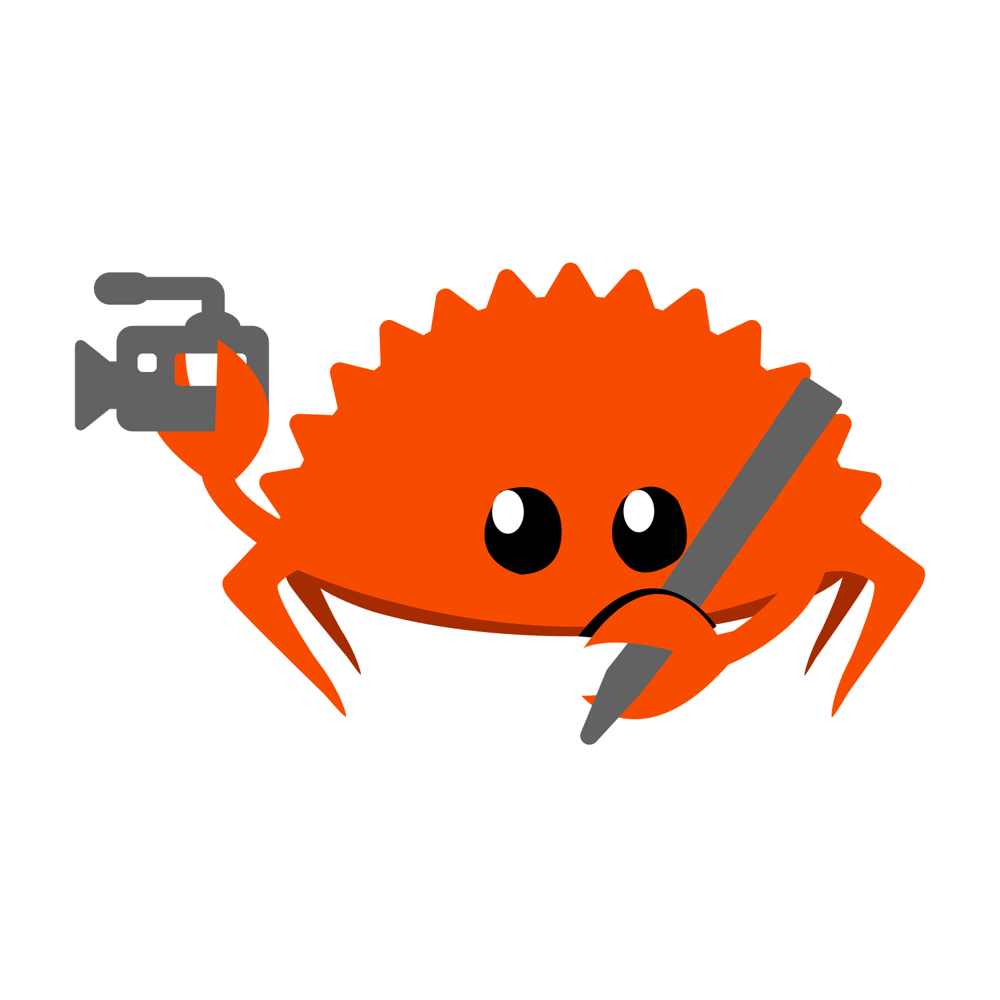

# The Rust Content Team - `t-content`

Welcome to the [`t-content`](https://www.rust-lang.org/governance/teams/launching-pad#team-content) repo!

## Mission

We create publishable content for the Rust Project from interviews to share with the entire Rust community. If you'd like a deep dive on our mission, see [here](./TEAM-MISSION.md).

Are you interested in being interviewed? Something interesting to share?
Please see [Interview contact](#interview-contact) below.

## Content produced

You can find a listing of content produced [here](./content/content-listing.md).

## Interview contact

Are you interested in talking about your experiences using Rust? Would you like to share so that others are aware of what might be happening in your industry or niche related to Rust?

Feel free to reach out to us at [#t-content](https://rust-lang.zulipchat.com/#narrow/channel/523012-t-content) on the Rust Zulip. Make a new topic and share your interest!
